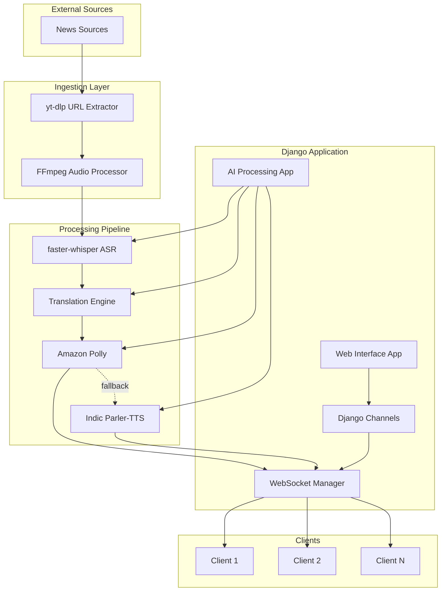

# Design Document: VartaSetu Streaming Engine

## Overview

Varta Setu is a real-time news translation and streaming engine built on Django with WebSocket support via Django Channels. The system follows a producer-consumer architecture where multiple workers process audio streams concurrently, transforming live news audio through ASR, translation, and TTS synthesis before streaming to clients.

The architecture emphasizes modularity with separate Django apps for web interface and AI processing, ensuring maintainability and scalability. The system handles high concurrency through Django Channels workers and maintains low latency through optimized processing pipelines.

## Architecture

### High-Level Architecture



### Producer-Consumer Model

The system implements a producer-consumer pattern where:
- **Producers**: Audio capture components (FFmpeg) generate audio chunks
- **Consumers**: Processing workers (ASR, Translation, TTS) consume and transform data
- **Queue Management**: Django Channels manages task distribution and worker coordination
- **Concurrency**: Multiple independent pipelines process different news streams simultaneously

### Modular Django Structure

```
Varta Setu/
├── web_interface/          # Django app for web views and API
│   ├── views.py           # HTTP endpoints and admin interface
│   ├── urls.py            # URL routing
│   └── templates/         # Web templates
├── ai_processing/         # Django app for AI pipeline
│   ├── audio_capture.py   # FFmpeg and yt-dlp integration
│   ├── speech_recognition.py  # faster-whisper wrapper
│   ├── translation.py     # Translation service integration
│   ├── text_to_speech.py  # TTS service management
│   └── pipeline.py        # Processing pipeline coordination
├── streaming/             # Django Channels WebSocket handling
│   ├── consumers.py       # WebSocket consumers
│   ├── routing.py         # WebSocket routing
│   └── workers.py         # Background processing workers
└── core/                  # Shared utilities and configuration
    ├── models.py          # Data models
    ├── settings.py        # Django configuration
    └── utils.py           # Common utilities
```

## Components and Interfaces

### URL Extraction Component

**Purpose**: Extract live stream URLs from news source pages using yt-dlp

**Interface**:
```python
class URLExtractor:
    def extract_stream_url(self, source_url: str) -> Optional[str]
    def validate_stream_url(self, stream_url: str) -> bool
    def get_stream_metadata(self, source_url: str) -> Dict[str, Any]
```

**Dependencies**: yt-dlp library
**Error Handling**: Returns None for invalid URLs, logs extraction failures

### Audio Processing Component

**Purpose**: Capture and segment live audio streams using FFmpeg

**Interface**:
```python
class AudioProcessor:
    def start_capture(self, stream_url: str, chunk_duration: float = 2.0) -> None
    def get_audio_chunk(self) -> Optional[AudioChunk]
    def stop_capture(self) -> None
    def is_capturing(self) -> bool
```

**Dependencies**: FFmpeg, pydub for audio manipulation
**Configuration**: Configurable chunk duration, audio format, sample rate

### ASR Engine Component

**Purpose**: Convert audio chunks to text using faster-whisper

**Interface**:
```python
class ASREngine:
    def transcribe_chunk(self, audio_chunk: AudioChunk) -> TranscriptionResult
    def set_language(self, language_code: str) -> None
    def get_confidence_threshold(self) -> float
```

**Dependencies**: faster-whisper, torch, numpy
**Performance**: Target <2 second processing time per chunk
**Configuration**: Model size, language detection, confidence thresholds

### Translation Engine Component

**Purpose**: Translate text between languages with fallback support

**Interface**:
```python
class TranslationEngine:
    def translate_text(self, text: str, target_lang: str) -> TranslationResult
    def set_primary_service(self, service: str) -> None
    def set_fallback_service(self, service: str) -> None
    def get_supported_languages(self) -> List[str]
```

**Dependencies**: deep-translator, google-generativeai
**Fallback Logic**: Automatic retry with secondary service on primary failure
**Performance**: Target <500ms processing time

### TTS Engine Component

**Purpose**: Synthesize speech with primary/fallback TTS services

**Interface**:
```python
class TTSEngine:
    def synthesize_speech(self, text: str, voice_config: VoiceConfig) -> AudioData
    def set_primary_service(self, service: TTSService) -> None
    def set_fallback_service(self, service: TTSService) -> None
    def get_available_voices(self) -> List[Voice]
```

**Dependencies**: boto3 (Amazon Polly), Indic Parler-TTS
**Fallback Logic**: Automatic switch to Indic Parler-TTS on Polly failure
**Performance**: Target <1 second synthesis time

### WebSocket Manager Component

**Purpose**: Handle client connections and audio streaming via Django Channels

**Interface**:
```python
class WebSocketManager:
    def add_client(self, client_id: str, websocket: WebSocket) -> None
    def remove_client(self, client_id: str) -> None
    def broadcast_audio(self, audio_data: AudioData, stream_id: str) -> None
    def get_client_count(self, stream_id: str) -> int
```

**Dependencies**: Django Channels, WebSocket protocol
**Concurrency**: Supports multiple concurrent client connections per stream

### Stream Worker Component

**Purpose**: Coordinate end-to-end processing pipeline for individual streams

**Interface**:
```python
class StreamWorker:
    def start_processing(self, source_url: str, target_language: str) -> str
    def stop_processing(self, stream_id: str) -> None
    def get_processing_status(self, stream_id: str) -> ProcessingStatus
    def get_performance_metrics(self, stream_id: str) -> ProcessingMetrics
```

**Dependencies**: All processing components
**Lifecycle**: Manages complete pipeline from URL extraction to client streaming

## Data Models

### Stream Configuration Model

```python
class StreamConfig:
    stream_id: str              # Unique identifier for stream
    source_url: str             # Original news source URL
    stream_url: str             # Extracted live stream URL
    source_language: str        # Detected/configured source language
    target_language: str        # Target translation language
    voice_config: VoiceConfig   # TTS voice settings
    processing_params: Dict     # ASR/Translation parameters
    created_at: datetime
    status: StreamStatus        # ACTIVE, STOPPED, ERROR
```

### Audio Chunk Model

```python
class AudioChunk:
    chunk_id: str              # Unique chunk identifier
    stream_id: str             # Associated stream
    audio_data: bytes          # Raw audio data
    duration: float            # Chunk duration in seconds
    timestamp: datetime        # Capture timestamp
    format: AudioFormat        # Audio format specification
    sample_rate: int           # Audio sample rate
```

### Transcription Result Model

```python
class TranscriptionResult:
    chunk_id: str              # Source audio chunk
    transcribed_text: str      # Recognized text
    confidence_score: float    # Recognition confidence (0-1)
    language_detected: str     # Detected language code
    processing_time: float     # Time taken for transcription
    timestamp: datetime        # Processing timestamp
    status: TranscriptionStatus # SUCCESS, FAILED, NO_SPEECH
```

### Translation Result Model

```python
class TranslationResult:
    source_text: str           # Original text
    translated_text: str       # Translated text
    source_language: str       # Source language code
    target_language: str       # Target language code
    service_used: str          # Translation service used
    processing_time: float     # Translation processing time
    confidence_score: float    # Translation confidence
    timestamp: datetime
```

### Audio Data Model

```python
class AudioData:
    audio_bytes: bytes         # Synthesized audio data
    format: AudioFormat        # Audio format (MP3, WAV, etc.)
    duration: float            # Audio duration
    voice_used: str            # TTS voice identifier
    service_used: str          # TTS service used (Polly/Parler)
    generation_time: float     # Synthesis time
    timestamp: datetime
```

### Processing Metrics Model

```python
class ProcessingMetrics:
    stream_id: str             # Associated stream
    total_chunks_processed: int
    average_asr_time: float    # Average ASR processing time
    average_translation_time: float
    average_tts_time: float
    end_to_end_latency: float  # Complete pipeline latency
    error_count: int           # Number of processing errors
    fallback_activations: int  # TTS fallback usage count
    active_clients: int        # Current connected clients
    last_updated: datetime
```

### Voice Configuration Model

```python
class VoiceConfig:
    voice_id: str              # TTS voice identifier
    language_code: str         # Voice language
    gender: str                # Voice gender
    speed: float               # Speech rate (0.5-2.0)
    pitch: float               # Voice pitch adjustment
    volume: float              # Audio volume level
    service_preference: str    # Primary TTS service
```

## Error Handling

### Component-Level Error Handling

**URL Extraction Errors**:
- Invalid URLs: Log error, return None, allow retry
- Network timeouts: Implement exponential backoff retry
- yt-dlp failures: Log detailed error, attempt alternative extraction methods

**Audio Processing Errors**:
- Stream disconnection: Attempt reconnection every 30 seconds
- FFmpeg crashes: Restart FFmpeg process, resume from last successful chunk
- Audio format issues: Convert to supported format, continue processing

**ASR Processing Errors**:
- Model loading failures: Retry with smaller model, log performance impact
- Chunk processing failures: Skip failed chunk, continue with next
- Memory issues: Clear processing cache, reduce concurrent processing

**Translation Errors**:
- Primary service failures: Automatic fallback to secondary service
- Rate limiting: Implement backoff and retry logic
- Invalid text input: Skip translation, pass original text through

**TTS Synthesis Errors**:
- Amazon Polly failures: Immediate switch to Indic Parler-TTS
- Voice unavailability: Use default voice, log voice change
- Synthesis timeouts: Retry once, then skip if still failing

### System-Level Error Recovery

**Stream Worker Failures**:
- Worker crashes: Restart worker, resume from last successful checkpoint
- Resource exhaustion: Implement graceful degradation, prioritize active streams
- Pipeline stalls: Detect stalls via timeout monitoring, restart affected components

**WebSocket Connection Errors**:
- Client disconnections: Clean up resources, remove from active client list
- Network issues: Implement reconnection logic with exponential backoff
- Message delivery failures: Log failed deliveries, continue with other clients

**Monitoring and Alerting**:
- Performance threshold violations: Generate alerts for administrator review
- Error rate spikes: Automatic notification and diagnostic data collection
- Resource usage monitoring: Proactive alerts before system limits reached

## Correctness Properties

*A property is a characteristic or behavior that should hold true across all valid executions of a system—essentially, a formal statement about what the system should do. Properties serve as the bridge between human-readable specifications and machine-verifiable correctness guarantees.*

Based on the prework analysis, the following properties validate the system's correctness across all inputs and scenarios:

### URL Extraction Properties

**Property 1: Valid URL extraction**
*For any* valid news source URL, the URL extractor should successfully return a valid live stream URL
**Validates: Requirements 1.1**

**Property 2: Invalid URL handling**
*For any* invalid or unreachable URL, the system should log the error and attempt reconnection without crashing
**Validates: Requirements 1.4**

### Audio Processing Properties

**Property 3: Audio chunking consistency**
*For any* live audio stream, the audio processor should produce chunks of consistent duration and format
**Validates: Requirements 1.3**

**Property 4: Stream capture reliability**
*For any* valid stream URL, the audio processor should successfully initiate audio capture
**Validates: Requirements 1.2**

### Speech Recognition Properties

**Property 5: ASR processing time constraint**
*For any* audio chunk, the ASR engine should complete transcription within 2 seconds
**Validates: Requirements 2.1, 7.2**

**Property 6: Transcription output format**
*For any* audio chunk containing speech, the ASR engine should output both transcribed text and confidence scores
**Validates: Requirements 2.2**

**Property 7: Silent audio handling**
*For any* audio chunk with no speech, the ASR engine should return empty results without generating errors
**Validates: Requirements 2.3**

**Property 8: ASR error recovery**
*For any* ASR processing failure, the system should log the error and continue processing the next chunk
**Validates: Requirements 2.4, 8.2**

**Property 9: Concurrent ASR processing**
*For any* set of concurrent audio streams, the ASR engine should process each stream independently without interference
**Validates: Requirements 2.5**

### Translation Properties

**Property 10: Translation completion**
*For any* valid transcribed text, the translation engine should produce translated output in the target language
**Validates: Requirements 3.1**

**Property 11: Translation time constraint**
*For any* successful translation, the processing should complete within 500ms
**Validates: Requirements 3.2, 7.3**

**Property 12: Translation fallback activation**
*For any* primary translation service failure, the system should automatically retry with the fallback service
**Validates: Requirements 3.3**

**Property 13: Invalid text handling**
*For any* empty or invalid text input, the translation engine should skip processing and continue without error
**Validates: Requirements 3.4**

### Text-to-Speech Properties

**Property 14: Primary TTS usage**
*For any* translated text, the TTS engine should attempt synthesis using Amazon Polly as the primary service
**Validates: Requirements 4.1**

**Property 15: TTS fallback mechanism**
*For any* Amazon Polly failure, the system should automatically switch to Indic Parler-TTS and log the fallback event
**Validates: Requirements 4.2, 4.4, 8.4**

**Property 16: TTS synthesis time constraint**
*For any* text synthesis request, the TTS engine should complete processing within 1 second
**Validates: Requirements 4.3, 7.4**

### WebSocket Streaming Properties

**Property 17: Client connection establishment**
*For any* client connection request, the WebSocket manager should successfully establish a connection via Django Channels
**Validates: Requirements 5.1**

**Property 18: Audio streaming delivery**
*For any* synthesized audio data, the WebSocket manager should deliver it to all connected clients for that stream
**Validates: Requirements 5.2**

**Property 19: Connection cleanup**
*For any* client disconnection, the WebSocket manager should clean up associated resources and remove the connection
**Validates: Requirements 5.3**

**Property 20: Concurrent connection handling**
*For any* number of concurrent client connections, the WebSocket manager should handle them efficiently without degradation
**Validates: Requirements 5.4**

**Property 21: Network resilience**
*For any* network connectivity issue, the WebSocket manager should attempt reconnection and resume streaming
**Validates: Requirements 5.5**

### Concurrency Properties

**Property 22: Worker isolation**
*For any* multiple concurrent stream requests, the system should spawn separate workers maintaining isolation between pipelines
**Validates: Requirements 6.1, 6.2**

**Property 23: Concurrent stream capacity**
*For any* load up to 10 concurrent streams, the system should maintain performance without degradation
**Validates: Requirements 6.3**

**Property 24: Resource prioritization**
*For any* resource-constrained scenario, the system should prioritize active streams over new requests
**Validates: Requirements 6.4**

**Property 25: Stream cleanup**
*For any* stream termination, the system should clean up all associated resources and workers
**Validates: Requirements 6.5**

### Performance Properties

**Property 26: End-to-end latency**
*For any* complete audio processing pipeline, the system should deliver translated audio within 4 seconds end-to-end
**Validates: Requirements 7.1**

**Property 27: Queue efficiency**
*For any* processing pipeline, queues should minimize waiting time between stages
**Validates: Requirements 7.5**

### Error Handling Properties

**Property 28: Comprehensive error logging**
*For any* component failure, the system should log detailed error information for debugging
**Validates: Requirements 8.1**

**Property 29: Translation retry logic**
*For any* translation failure, the system should retry once before skipping the text segment
**Validates: Requirements 8.3**

**Property 30: Stream reconnection timing**
*For any* unavailable stream source, the system should attempt reconnection every 30 seconds
**Validates: Requirements 8.5**

### Configuration and Monitoring Properties

**Property 31: Configuration availability**
*For any* system deployment, configuration options for timeouts and quality settings should be available and modifiable
**Validates: Requirements 10.1**

**Property 32: Threshold alerting**
*For any* processing metrics exceeding configured thresholds, the system should generate administrator alerts
**Validates: Requirements 10.2**

**Property 33: Performance logging**
*For any* pipeline stage execution, processing times should be logged for monitoring
**Validates: Requirements 10.3**

**Property 34: Load metrics availability**
*For any* high system load scenario, metrics on concurrent stream counts should be available
**Validates: Requirements 10.4**

**Property 35: Health check endpoints**
*For any* system deployment, health check endpoints should be available and respond correctly to monitoring systems
**Validates: Requirements 10.5**

## Testing Strategy

### Dual Testing Approach

The system requires both unit testing and property-based testing for comprehensive validation:

**Unit Tests**: Focus on specific examples, edge cases, and integration points
- Component initialization and configuration
- Error condition handling with specific inputs
- Integration between Django apps and external services
- WebSocket connection lifecycle management
- Specific audio format handling

**Property Tests**: Verify universal properties across all inputs using property-based testing
- Each correctness property above should be implemented as a property-based test
- Minimum 100 iterations per property test to ensure comprehensive input coverage
- Use hypothesis (Python) for property-based test generation
- Tag each test with format: **Feature: vikas-varta-streaming-engine, Property N: [property description]**

### Property-Based Testing Configuration

**Library Selection**: Use `hypothesis` for Python-based property-based testing
**Test Configuration**:
- Minimum 100 iterations per property test
- Custom generators for audio data, text content, and URL formats
- Timeout configurations matching system performance requirements
- Resource cleanup after each test iteration

**Test Data Generation**:
- Audio chunk generators with varying durations and formats
- Text generators with different languages and character sets
- URL generators for valid and invalid news source formats
- Network condition simulators for testing resilience

**Performance Validation**:
- Time-based assertions for latency requirements
- Resource usage monitoring during concurrent testing
- Memory leak detection across multiple test iterations
- Throughput measurement under various load conditions

### Integration Testing Strategy

**Component Integration**:
- Test complete pipeline from URL extraction to client delivery
- Validate fallback mechanisms under simulated service failures
- Test Django Channels WebSocket integration with concurrent clients
- Verify proper resource cleanup across component boundaries

**External Service Integration**:
- Mock external services (Polly, translation APIs) for reliable testing
- Test actual service integration in staging environment
- Validate API rate limiting and error handling
- Test service authentication and authorization flows

**Load Testing**:
- Simulate 10+ concurrent streams to validate concurrency requirements
- Test system behavior under resource constraints
- Validate graceful degradation when limits are exceeded
- Monitor system recovery after load reduction